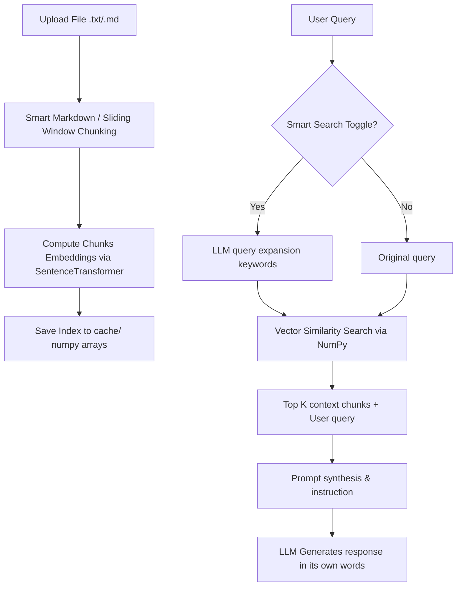

A lightweight, local-first RAG application. Uses FastAPI, local embedding models via SentenceTransformers, NumPy for high-performance vector operations, and supports both **OpenAI** and local **Ollama** LLMs.

---

## Key Features

* **Dual LLM Support**: Seamlessly switch between OpenAI (GPT models) and local Ollama models (Llama, Mistral, Qwen, etc.) using a simple dropdown.
* **Local Embeddings & Vector Store**: Uses `all-MiniLM-L6-v2` locally via SentenceTransformers to generate text embeddings, saving them to a local NumPy cache (`.npy`).
* **High-Performance Retrieval**: Utilizes NumPy to calculate cosine similarity across all document chunks rapidly without needing a heavy standalone vector database.
* **Smart Markdown Chunking**: Analyzes Markdown files (`.md`) intelligently by splitting sections at headings (`#`, `##`, `###`), sub-chunking oversized sections, and merging tiny chunks to keep context coherent. Falls back to sliding-window chunking for plain `.txt` files.
* **Smart Search (Query Expansion)**: When toggled on, the system uses an LLM-behind-the-scenes to expand vague search queries (e.g. *"who are team members"* -> *"team members names contributors authors people involved"*), dramatically improving cosine similarity matches.
* **Beautiful Dark UI**: Modern single-page web interface with a responsive glassmorphism dark theme. 
* **Fixed-Height Scroll Layout**: Separate, independent scrollable areas for document management and chat interactions so that large model responses never crowd out document uploads.
* **Interactive Document Manager**: Upload, view, and delete documents (`.txt` and `.md`) directly from the browser. The index updates automatically in real-time.

---

## Tech Stack

* **Backend**: FastAPI (Python), Uvicorn, NumPy, SentenceTransformers, OpenAI SDK, HTTPX
* **Frontend**: HTML5, Vanilla CSS3 (Glassmorphism design system), Vanilla ES6 JavaScript
* **Database/Index**: Local NumPy files (`.npy` and `.json` cache)

---

## Installation & Setup

### Prerequisites
* Python 3.8 or higher
* (Optional) [Ollama](https://ollama.com/) installed and running locally for completely offline LLM inference.

### Setup Instructions

1. **Clone the Repository**
   ```bash
   git clone https://github.com/YOUR_USERNAME/numpy-rag-prototype.git
   cd numpy-rag-prototype
   ```

2. **Install Dependencies**
   It is recommended to use a virtual environment:
   ```bash
   python -m venv venv
   source venv/bin/activate  # On Windows: venv\Scripts\activate
   pip install -r requirements.txt
   ```

3. **Start the Application**
   You can start the server using the pre-configured scripts:
   * **Windows**: Double-click `run.bat` or run:
     ```cmd
     run.bat
     ```
   * **Linux/macOS**: Run:
     ```bash
     chmod +x run.sh
     ./run.sh
     ```

4. **Access the App**
   Open your browser and navigate to **`http://127.0.0.1:8000`**.

---

## How It Works (RAG Flow)



1. **Ingestion**: Documents uploaded through the UI are split into semantic chunks.
2. **Indexing**: Embeddings are computed locally using SentenceTransformers and saved directly as an `.npy` file.
3. **Retrieval**: When a query is made, its embedding is compared to all document chunk embeddings via a vectorized NumPy dot product to identify the top 5 most relevant sections.
4. **Synthesis**: The relevant sections are compiled into a comprehensive prompt, and the selected LLM (OpenAI or Ollama) produces an answer formatted in Markdown.

---

## Configuration

* **OpenAI API Key**: You can provide your key directly in the web UI settings panel (which persists it to `api_key.txt` locally) or set it as an environment variable `OPENAI_API_KEY`.
* **Local Models**: Ensure your local Ollama server is running (`ollama serve`). The backend automatically queries Ollama to retrieve and populate all available chat models in the dropdown.
